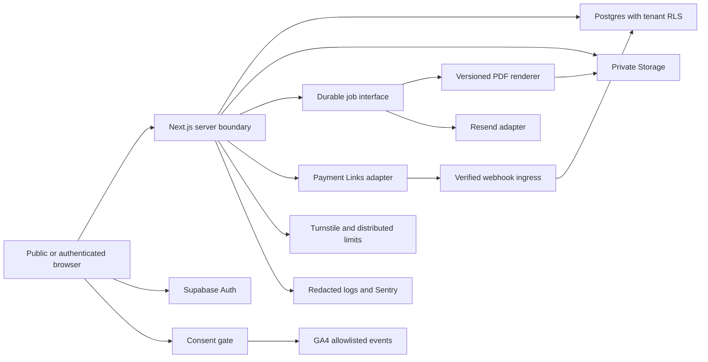

# Architecture

Status: target architecture; foundation code is established separately in Task 01 evidence. Service integrations and deployment isolation are not yet verified.

Proposed owner: Engineering Lead; named assignment pending. Review on a service/provider change, trust-boundary change, new job/store, residency decision or major framework upgrade; quarterly after launch. Last reviewed: 2026-09-06.

## Required stack and boundaries

Use Next.js App Router, strict TypeScript, Tailwind and accessible components. Supabase supplies Postgres, Auth and private Storage. Vercel hosts independent preview/staging/production deployments. Resend + React Email handles transactional delivery. A provider-neutral Payment Links adapter accepts only verified webhook payment facts. Versioned server-side PDF jobs render canonical domain schemas. GA4, Search Console and IndexNow serve measurement/indexation; Sentry, structured logs, Cloudflare Turnstile and a distributed limiter serve operations and abuse prevention. GitHub CI gates deployment. Provider/library versions are defined by the lockfile; no production provider account is assumed.

Untrusted browser fields cross a schema-validation and authentication boundary before authorization. RLS is the final tenant boundary. Supabase browser-safe configuration must never include service-role privileges. Secret clients and provider adapters remain server-only. Signed downloads authorize the tenant and entitlement before issuing short-lived access. Webhooks authenticate the original bytes, enforce replay limits and transact deduplicated state. Jobs carry stable IDs, tenant scope, trace IDs and attempt state; retries cannot duplicate artifacts, email or entitlements.

## Application layers

- App Router routes/components: presentation, accessibility, loading/error/empty states and server entry points.
- Domain modules: deterministic units, money, totals, canonical schemas, state transitions and shipment-to-document dependency registry. No arithmetic in templates/components.
- Server application services: authorization, transactions, idempotency, entitlements and audit emission.
- Adapters: Supabase, payments, mail, render/storage, metrics and abuse services behind typed interfaces where required.

Avoid premature microservices. Choose the durable queue/worker and PDF implementation through an ADR after bounding concurrency, serverless runtime limits, retries, reproducibility and font/licensing needs.

## Environment and data isolation

Test environments use synthetic fixtures. The target architecture includes local development, but the user's current “no local runs” instruction prohibits running the app, database, build or tests locally; use authorized CI/cloud environments for execution. Preview and staging must use independent non-production projects, secrets, storage, payment sandbox, mail recipients and telemetry tags; production data must never be copied to previews. Validate required configuration at build/startup by environment and enabled capability. A missing provider blocks its capability with an actionable configuration error. The foundation configuration may disable external capabilities without pretending they exist. Health/readiness endpoints must disclose no credentials or customer metadata.

## Failure behavior to implement in Task 02

| Service failure        | Required behavior                                                                |
| ---------------------- | -------------------------------------------------------------------------------- |
| Auth/database          | Deny protected writes; explain retry; do not fall back to unauthenticated access |
| Payments               | Preserve pending order; grant no access from redirects; retry reconciliation     |
| PDF/storage            | Persist per-artifact failure; resume job safely; retain immutable prior files    |
| Email                  | Queue retry/suppression state; expose delivery status without duplicating sends  |
| Rate limiter/Turnstile | Apply documented fail-closed rules for risky operations with accessible recovery |
| Analytics/indexing     | Preserve core workflows; retry bounded eligible submissions                      |
| Observability          | Avoid leaking content in fallback logs; alert on telemetry loss                  |

Store ownership/classification is in [DATABASE.md](DATABASE.md); security controls in [SECURITY.md](SECURITY.md); SLO/recovery decisions in [OPERATIONS.md](OPERATIONS.md). Task 02 must turn each target into tested configuration, request/data flows and evidence.
